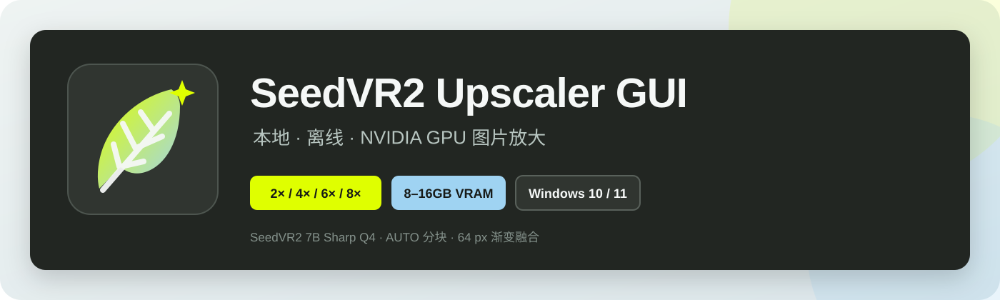
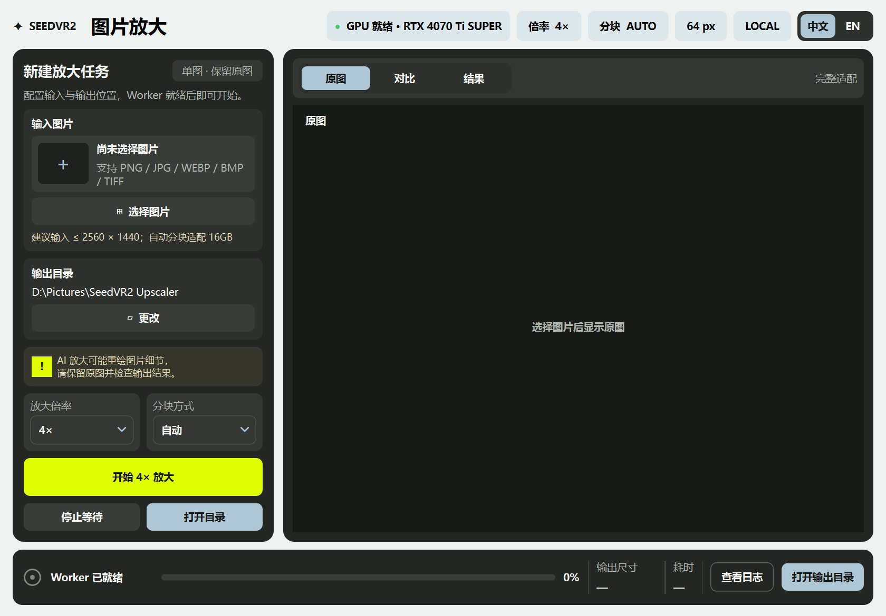
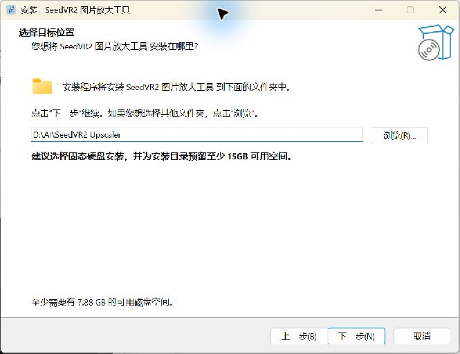

# SeedVR2 Upscaler GUI

[简体中文](./README.md) | [English](./README_EN.md)



[](../../releases/latest)
[](../../releases/tag/v1.1.0)
[](./LICENSE)

一款面向 Windows 的本地 SeedVR2 图片放大工具。无需安装 Python 或 ComfyUI，选择图片后即可使用 NVIDIA GPU 完成 2×、4×、6×、8× 放大，并在界面内查看原图、滑动对比和结果。

> 当前版本：`1.1.0` · Windows x64 · 本地离线运行 · SeedVR2 7B Sharp Q4



## 功能亮点

- 完全本地运行，图片不会上传到云端。
- 桌面界面已重构为 PySide6/Qt Widgets，窗口拖动和缩放实时跟随，圆角与控件由 Qt 原生绘制。
- 支持点击选择或直接拖入 PNG、JPG、WEBP、BMP、TIFF 图片。
- 提供 2× / 4× / 6× / 8× 倍率预设；6×、8× 会在运行前提示资源和细节风险。
- 自动分块面向 8–16GB 显存设计，也可手动选择 3×3、4×4、5×5。
- 原图、左右滑动对比、结果三种查看模式；鼠标滚轮缩放，拖动平移。
- 64 px 渐变融合，减少分块接缝。
- 应用与安装向导均支持简体中文/英文；首次跟随 Windows，右上角可即时切换并记住选择。
- 标准 Windows 安装向导，可选择语言、安装路径、桌面和开始菜单快捷方式。
- 安装包包含独立 Python Runtime、CUDA 运行依赖与模型，不依赖 ComfyUI。

## 下载与安装

前往 [Releases](../../releases/latest) 下载 `v1.1.0` 的以下文件：

```text
SeedVR2-Setup-1.1.0.exe
SeedVR2-Setup-1.1.0-1.bin
SeedVR2-Setup-1.1.0-2.bin
SeedVR2-Setup-1.1.0-3.bin
SeedVR2-Setup-1.1.0-4.bin
```

把 EXE 和四个 BIN 分卷放在同一目录，双击 EXE，选择简体中文或 English，再按向导选择安装位置和快捷方式即可。建议安装到固态硬盘，并为安装目录预留至少 15GB 可用空间。



安装不需要管理员权限、Python、ComfyUI 或网络连接。安装包目前没有代码签名证书，Windows 可能显示 SmartScreen 提示；可使用 Release 中的 `SHA256SUMS.txt` 校验文件完整性。

## 硬件要求

| 项目 | 要求或状态 |
|---|---|
| 系统 | Windows 10/11 x64 |
| 显卡 | NVIDIA GPU，兼容 CUDA 13.0 的驱动 |
| 显存 | 自动分块面向 8GB、12GB、16GB 设计 |
| 已实测 | RTX 4070 Ti SUPER 16GB |
| 磁盘 | 安装目录建议至少预留 15GB，优先 SSD |

8GB、12GB 的自适应策略已实现并有自动测试，但尚未完成对应显卡实机验证。6GB 显存显卡不在当前支持范围内。

## 使用方法

1. 选择或拖入一张图片。
2. 选择输出目录、放大倍率和分块方式；不确定时保持 `AUTO`。
3. 点击“开始放大”。
4. 完成后在“对比”页拖动分界线查看前后差异，滚轮可放大细节。
5. 检查结果后再用于正式项目。

SeedVR2 属于生成式放大，可能重绘小文字、Logo、人脸、产品细节和纹理。请保留原图，并逐张检查输出结果。

## 倍率说明

SeedVR2 模型原生生成 4× 结果。2× 会从原生结果缩小，6×、8× 会从原生结果继续重采样，因此更高倍率代表更大的输出尺寸，不代表模型生成了更多可靠细节。

## 模型与来源

完整安装包包含以下 Apache-2.0 模型文件：

| 文件 | 来源 | SHA256 |
|---|---|---|
| `seedvr2_ema_7b_sharp-Q4_K_M.gguf` | [cmeka/SeedVR2-GGUF](https://huggingface.co/cmeka/SeedVR2-GGUF/blob/main/seedvr2_ema_7b_sharp-Q4_K_M.gguf) | `7AED800AC4EB8E0D18569A954C0FF35F5A1CAA3ED5D920E66CC31405F75B6E69` |
| `ema_vae_fp16.safetensors` | [Comfy-Org/SeedVR2](https://huggingface.co/Comfy-Org/SeedVR2/blob/main/vae/ema_vae_fp16.safetensors) | `20678548F420D98D26F11442D3528F8B8C94E57EE046EF93DBB7633DA8612CA1` |

完整署名与第三方许可证说明见 [THIRD_PARTY_NOTICES.md](./THIRD_PARTY_NOTICES.md)。

## 从源码运行

源码仓库不包含约 5GB 的模型文件和约 3GB 的独立 Runtime。

```powershell
powershell -ExecutionPolicy Bypass -File .\scripts\install-runtime.ps1
```

将两个模型放入 `models/SEEDVR2/`，然后执行：

```powershell
.\runtime\python\python.exe -B -m app.cli check --cuda
.\runtime\python\python.exe -B -m app.gui
```

运行自动测试：

```powershell
.\runtime\python\python.exe -B -m unittest discover -s tests -v
```

构建标准 Windows 安装包：

```powershell
powershell -ExecutionPolicy Bypass -File .\packaging\build-setup.ps1
```

完整依赖版本见 [requirements-lock.txt](./requirements-lock.txt)，技术验证数据见 [VALIDATION-REPORT.md](./VALIDATION-REPORT.md)。

## 版本记录

- `1.1.0`：首个标准 Windows 安装向导版本，也是当前公开发行版。
- `1.0.3`：第一版的首次功能更新，加入多倍率、自适应分块、拖放和对比预览。
- `1.0.2`：首次完整安装版。

详细变更见 [CHANGELOG.md](./CHANGELOG.md)，`v1.1.0` 发布文案见 [docs/releases/v1.1.0.md](./docs/releases/v1.1.0.md)。

## 致谢与许可证

本项目基于 [IceClear/SeedVR2](https://github.com/IceClear/SeedVR2) 构建，与 SeedVR2 官方团队无隶属关系。

本项目第一方代码采用 [Apache License 2.0](./LICENSE)。第三方源码、模型、Python Runtime 和依赖仍分别遵循其各自许可证。
