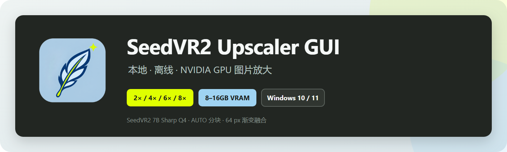
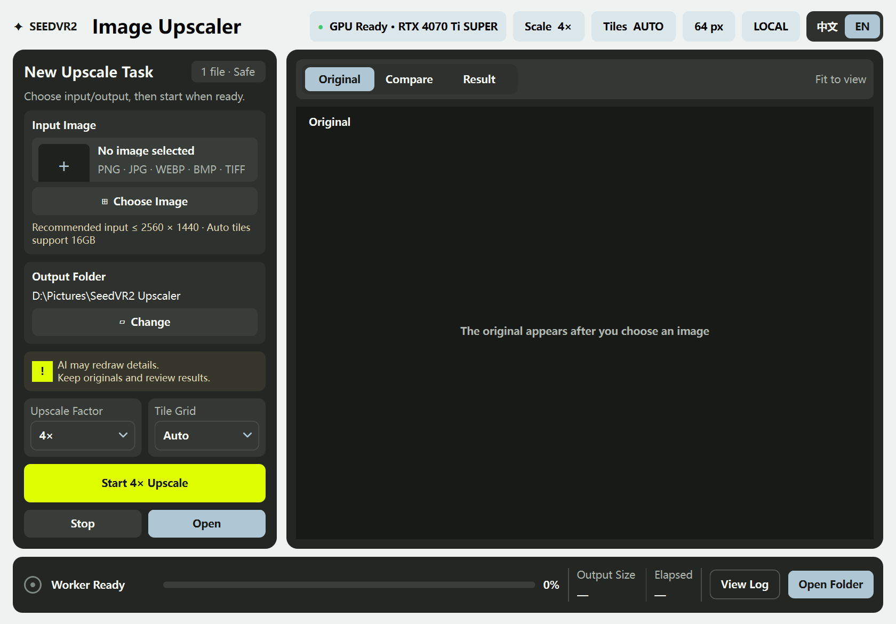

# SeedVR2 Upscaler GUI

[简体中文](./README.md) | [English](./README_EN.md)



[](../../releases/latest)
[](../../releases/tag/v1.1.0)
[](./LICENSE)

A local SeedVR2 image upscaler for Windows. It runs on an NVIDIA GPU without requiring a separate Python or ComfyUI installation, provides 2×, 4×, 6×, and 8× output presets, and includes original, interactive comparison, and result previews.

> Current release: `1.1.0` · Windows x64 · Fully local · SeedVR2 7B Sharp Q4



## Highlights

- Runs entirely on your computer. Images are not uploaded to a cloud service.
- The desktop interface is rebuilt with PySide6/Qt Widgets for responsive live window resizing and native Qt-rendered controls.
- Add PNG, JPG, WEBP, BMP, or TIFF images with the file picker or drag and drop.
- Choose 2×, 4×, 6×, or 8× output presets. The app displays an additional warning before 6× and 8× jobs.
- VRAM-aware automatic tiling is designed for 8–16 GB GPUs; 3×3, 4×4, and 5×5 manual grids are also available.
- Switch between the original image, an interactive before/after slider, and the result. Use the mouse wheel to zoom and drag to pan.
- Uses a 64 px feathered blend to reduce visible tile seams.
- The app and installer support Simplified Chinese and English. The app follows Windows on first launch, switches instantly from the top-right control, and remembers the choice.
- Includes a standard Windows setup wizard with language selection, a selectable installation folder, and optional desktop and Start Menu shortcuts.
- The full installer includes its own Python runtime, CUDA runtime dependencies, and model files. ComfyUI is not required.

## Download and installation

Open the latest [GitHub Release](../../releases/latest) and download all five files listed below:

```text
SeedVR2-Setup-1.1.0.exe
SeedVR2-Setup-1.1.0-1.bin
SeedVR2-Setup-1.1.0-2.bin
SeedVR2-Setup-1.1.0-3.bin
SeedVR2-Setup-1.1.0-4.bin
```

Keep the EXE and all four BIN volumes in the same folder, run the EXE, choose English or Simplified Chinese, and follow the setup wizard. An SSD is recommended, with at least 15 GB of free space available in the installation location.


Installation does not require administrator privileges, a separate Python environment, ComfyUI, or an internet connection. The installer is currently unsigned, so Windows may display a SmartScreen warning. Use the `SHA256SUMS.txt` file attached to the Release to verify download integrity.

## System requirements

| Item | Requirement or status |
|---|---|
| Operating system | Windows 10/11 x64 |
| GPU | NVIDIA GPU with a driver compatible with CUDA 13.0 |
| VRAM | Automatic tiling profiles are designed for 8 GB, 12 GB, and 16 GB |
| Hardware tested | RTX 4070 Ti SUPER 16 GB |
| Storage | At least 15 GB free in the installation folder; SSD recommended |

The 8 GB and 12 GB adaptive profiles are implemented and covered by automated tests, but have not yet been validated on matching physical GPUs. GPUs with 6 GB of VRAM are outside the current supported range.

## Usage

1. Select an image or drag it into the input card.
2. Choose an output folder, scale preset, and tiling mode. Leave tiling on `AUTO` if you are unsure.
3. Select **Start Upscaling**.
4. When processing is complete, open the comparison view and drag the divider to inspect the before/after result. Use the mouse wheel to inspect fine details.
5. Review the output before using it in production work.

SeedVR2 is a generative upscaler and may redraw small text, logos, faces, product details, textures, or edges. Keep the source image and inspect every output.

## Scale behavior

SeedVR2 natively produces a 4× result. The 2× preset downsamples that native result, while 6× and 8× continue resampling it to a larger output size. A higher preset therefore creates a larger image, but does not guarantee additional reliable model-generated detail.

## Models and sources

The full installer contains the following model files, whose source pages identify them as Apache-2.0:

| File | Source | SHA256 |
|---|---|---|
| `seedvr2_ema_7b_sharp-Q4_K_M.gguf` | [cmeka/SeedVR2-GGUF](https://huggingface.co/cmeka/SeedVR2-GGUF/blob/main/seedvr2_ema_7b_sharp-Q4_K_M.gguf) | `7AED800AC4EB8E0D18569A954C0FF35F5A1CAA3ED5D920E66CC31405F75B6E69` |
| `ema_vae_fp16.safetensors` | [Comfy-Org/SeedVR2](https://huggingface.co/Comfy-Org/SeedVR2/blob/main/vae/ema_vae_fp16.safetensors) | `20678548F420D98D26F11442D3528F8B8C94E57EE046EF93DBB7633DA8612CA1` |

See [THIRD_PARTY_NOTICES.md](./THIRD_PARTY_NOTICES.md) for attribution and third-party licensing details.

## Running from source

The source repository does not contain the approximately 5 GB of model files or the approximately 3 GB standalone runtime.

```powershell
powershell -ExecutionPolicy Bypass -File .\scripts\install-runtime.ps1
```

Place both model files in `models/SEEDVR2/`, then run:

```powershell
.\runtime\python\python.exe -B -m app.cli check --cuda
.\runtime\python\python.exe -B -m app.gui
```

Run the automated tests:

```powershell
.\runtime\python\python.exe -B -m unittest discover -s tests -v
```

Build the standard Windows installer:

```powershell
powershell -ExecutionPolicy Bypass -File .\packaging\build-setup.ps1
```

See [requirements-lock.txt](./requirements-lock.txt) for the complete dependency lock and [VALIDATION-REPORT.md](./VALIDATION-REPORT.md) for technical validation data.

## Release history

- `1.1.0`: First release with a standard Windows setup wizard and the current public release.
- `1.0.3`: First feature update, adding scale presets, adaptive tiling, drag and drop, and interactive comparison previews.
- `1.0.2`: First complete installer release.

See [CHANGELOG.md](./CHANGELOG.md) for the detailed change log and [docs/releases/v1.1.0.md](./docs/releases/v1.1.0.md) for the bilingual `v1.1.0` Release notes.

## Credits and license

This project is built on [IceClear/SeedVR2](https://github.com/IceClear/SeedVR2) and is not affiliated with the official SeedVR2 team.

First-party code in this repository is available under the [Apache License 2.0](./LICENSE). Third-party source code, models, the Python runtime, and bundled dependencies remain subject to their respective licenses.
